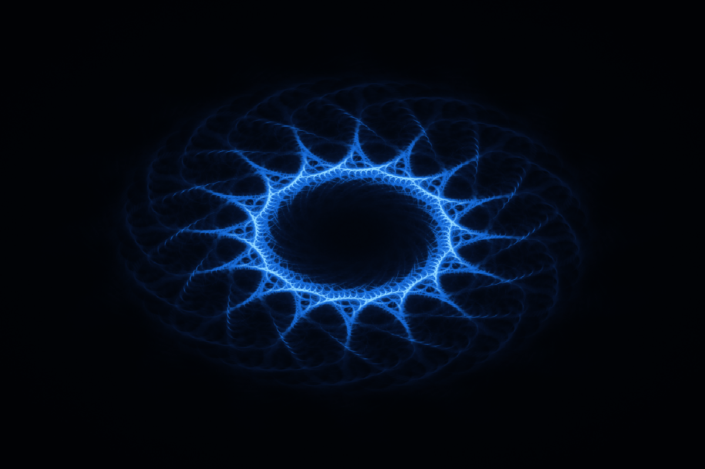

# Möbius Complex Dynamics Laboratory

An interactive real-time mathematical artwork and generative dynamics laboratory running directly in WebGL2.



## Core Mathematics

The artwork emerges iteratively from repeated complex-number Möbius transformations:

$$f(z) = \frac{az + b}{cz + d}$$

combined with rotational copies using roots of unity:

$$\omega_k = e^{2\pi i k / n}, \quad k \in \{0, 1, \dots, n-1\}$$

Trajectories are generated on the GPU using WebGL2 Transform Feedback and accumulated into a 32-bit floating-point accumulation buffer (`RGBA32F` with `RGBA16F` fallback). Visual luminance emerges naturally from trajectory recurrence density.

## Key Features

- **GPU Simulation Engine:** Transform Feedback pipeline processing up to 1.2M+ trajectory deposits per frame.
- **Drift-Aware Persistence Architecture:**
  - **Stationary Idle:** $p = 0.99925$ for deep photographic accumulation and microscopic filament resolution.
  - **Autonomous Drift:** $p = 0.9985$ to maintain stark negative-space contrast and prevent motion haze.
  - **Active Interaction:** $p = 0.97$ to prevent blackout dimming while clearing drag trails smoothly within 1–2 seconds.
- **Adaptive Performance:** Dynamic tiering (Standard: 150k particles $\times$ 8 steps) targeting stable 60 FPS across varied hardware.
- **Multi-Scale Deep Zoom:** Smooth continuous zoom from macroscopic organism to hairline caustics and nested orbital loops.
- **Live Equation Readout:** Real-time parameter display tracking complex coefficients $a, b, c, d$ and rotational order $n$.

## Interactive Controls

| Action | Control |
| :--- | :--- |
| **Pointer Drag** | Perturb complex coefficients in real-time |
| **Click / Tap** | Inject topological shock disturbance with smooth relaxation |
| **Mouse Wheel / Pinch** | Continuous deep multi-scale zoom |
| **Keys 1 – 6** | Switch morphology presets (`lace`, `knot`, `crown`, `storm`, `braid`, `specimen`) |
| **N / Shift + N** | Change rotational symmetry order $n$ |
| **P** | Pause / resume autonomous coefficient drift |
| **R** | Reset zoom and view position |
| **D** | Toggle development profiler HUD |
| **H** | Hide / show live mathematical equation readout |

## Local Development

Run any static HTTP server in the project directory:

```bash
# Python 3
python -m http.server 8000

# Node.js
npx serve .
```

Open `http://localhost:8000` in any modern browser supporting WebGL2.
